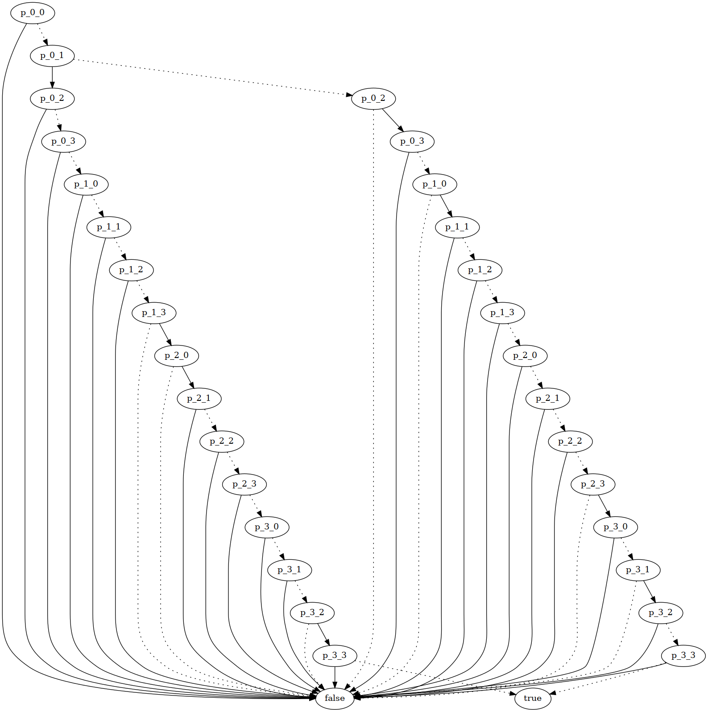

# GoBDD: Binary Decision Diagram implementation in Go

[](https://github.com/timbeurskens/gobdd/actions/workflows/go.yml)

This project attempts to implement a simple boolean satifiability solver in Go using Reduced-ordered Binary Decision Diagrams.
Users can define their boolean equations and apply the BDD transformation to get a ROBDD (in Graphviz Dot format).
Additional testing methods are available to test for tautologies, contradictions and equivalence.
Equations in CNF can be solved by applying the Conflict-Driven Clause-Learning (CDCL) method.
The Tseitin transformation can be applied to non-CNF formulas to get an equation in CNF which is satisfiable iff the original equation is satisfiable.
Tautology and contradiction testing for the CDCL output is not (yet) supported.

The current (BDD) based method is very inefficient and contains some problems. The N-queens problem can be solved for N=6 in roughly 6 minutes.
Model-search in both ROBDD-based and CDCL methods is supported by this framework.

## Contents

- [Operators](#operators)
  - [Boolean](#boolean)
  - [Numeric](#numeric)
- [Transformations](#transformations)
  - [Unary](#unary)
  - [Normalize](#normalize)
  - [DeMorgan](#demorgan)
  - [NNF](#nnf)
  - [Tseitin](#tseitin)
  - [CNF](#cnf)  
- [Solvers](#solvers)
  - [BDD](#bdd)
  - [CDCL](#cdcl)
- [Examples](#examples)
  - [Tautology test for p or not p](#example-tautology-test-for-p-or-not-p)
  - [N-queens graphical BDD model](#example-n-queens-graphical-bdd-model)
  - [CDCL SAT solving](#example-cdcl-sat-solving)
  - [CDCL after applying the Tseitin transformation](#example-cdcl-after-applying-the-tseitin-transformation)
  - [Prime decomposition](#example-prime-decomposition) 

## Operators

### Boolean

The core building blocks of expressions are boolean operators, constants, and variables.
Variables can be constructed using the `Var(str)` function, whereas constants are either identified by `TrueConst` and `FalseConst`, or constructed using `Cons(bool)`.

| Operation             | Symbol | Function signature                |
|-----------------------|:------:|-----------------------------------|
| Negation              | ¬      | Not(Expression)                   |
| Conjunction           | ∧      | And(Expression...)                |
| Disjunction           | ∨      | Or(Expression...)                 |
| Exclusive disjunction | ⊗     | Xor(Expression...)                |
| Implication           | →      | Implies(Expression, Expression)   |
| Bi-implication        | ⟷     | Biimplies(Expression, Expression) |

### Numeric

The package "Numerics" contains arithmetic operations on numeric types, suitable for solving in the SAT-solvers implemented in the algorithms package.
This version currently only supports numerics of the "Naturals" class: whole numbers greater than, and including zero.
Integers, fractionals and fixed-point classes could be added in later versions.
Solving numeric equations requires a significant amount of computing power.
The current CDCL implementation is not suitable for computing multiplications within reasonable time windows.

| Operation             | Symbol* | Function signature                |
|-----------------------|:-------:|-----------------------------------|
| Equality              | =       | Equals(Number, Number)            |
| Shift                 | ≪      | Shift(Number, int)                |
| Addition              | +       | Add(Number, Number, Number)       |
| Multiplication        | ×       | Mult(Number, Number, Number)      |

*Contrary to boolean operations, symbols displayed in the numeric operations table will not be used in any of the produced diagrams by the tool.
Numeric operations are immediately translated to their boolean counterpart and will be displayed as such.

## Transformations

### Unary

The BDD algorithm (`FromExpression`) assumes only binary operators exist in the given expression.
If the expression contains any unary operators (negations), the expression can be corrected with the `PruneUnary(Expression)` function.
The unary elimination algorithm recursively replaces all negations in the subtree according to the following rule:


```verbose
Not(a) = Implies(a, false)
```

### Normalize

The `Normalize` transformation replaces all operators that are not a conjunction, disjunction or negation to an equivalent expression only containing conjunctions, disjunctions, or negations.
The following ruleset is applied:

```verbose
a    ≡ a
¬a   ≡ ¬a
a∧b  ≡ a∧b
a∨b  ≡ a∨b
a⊗b ≡ (a∨b)∧¬(a∧b)
a→b  ≡ ¬a∨b
a⟷b ≡ (¬a∨b)∧(¬b∨a)
```

### DeMorgan

The De Morgan transformation is applied on [normalized](#normalize) expressions to recursively move all negations to the leafs: variables and/or constants.
The transformation applies the following ruleset:

```verbose
¬⊤     ≡ ⊥
¬⊥     ≡ ⊤
¬a     ≡ ¬a
¬(a∧b) ≡ ¬a∨¬b
¬(a∨b) ≡ ¬a∧¬b
```

### NNF

An expression can be converted to negation-normal form such that the result is equivalent and only contains conjunctions, disjunctions and negations.
All negations in the resulting expression are pushed to the leafs. The NNF transformation first applies the [normalization](#normalize) transformation, after which a [DeMorgan](#demorgan) transformation is applied to push negations to the leafs.

### Tseitin

The Tseitin transformation converts an expression in [negation-normal form](#nnf) to a SAT equivalent expression in conjunction-normal form (CNF), suitable for the [CDCL](#cdcl) solver.

### CNF

## Solvers

### BDD

### CDCL

Conflict-driven clause-learning is a CNF-based SAT solving technique.

## Examples

### Example: tautology test for p or not p

```go
b := Bench{T: t}
p := Var("p")

b.AssertTautology(
    "p or not p is a tautology",
    algorithm.FromExpression(
        Or(p, Not(p)),
    ),
)
```

### Example: N-queens graphical BDD model
The image below shows the generated decision diagram for a 4x4 n-queens solution.
For any node, "true" edges are solid and "false" edges are dotted.
A variable p_{x}_{y} determines whether a queen should be placed on tile (x,y).
This model is found by solving the following expression:

```text
(((((((((((((((((((((((((((((((((((((((((((((((((((((((((((((((((((((((((((((((((((
(true ∧ ((((false ∨ p_0_0) ∨ p_0_1) ∨ p_0_2) ∨ p_0_3)) ∧ ((((false ∨ p_1_0) ∨ p_1_1) ∨ p_1_2) ∨ p_1_3)) ∧ 
((((false ∨ p_2_0) ∨ p_2_1) ∨ p_2_2) ∨ p_2_3)) ∧ ((((false ∨ p_3_0) ∨ p_3_1) ∨ p_3_2) ∨ p_3_3)) ∧ 
((((false ∨ p_0_0) ∨ p_1_0) ∨ p_2_0) ∨ p_3_0)) ∧ ((((false ∨ p_0_1) ∨ p_1_1) ∨ p_2_1) ∨ p_3_1)) ∧ 
((((false ∨ p_0_2) ∨ p_1_2) ∨ p_2_2) ∨ p_3_2)) ∧ ((((false ∨ p_0_3) ∨ p_1_3) ∨ p_2_3) ∨ p_3_3)) ∧ 
(( ¬ p_0_1) ∨ ( ¬ p_0_0))) ∧ (( ¬ p_0_2) ∨ ( ¬ p_0_0))) ∧ (( ¬ p_0_2) ∨ ( ¬ p_0_1))) ∧ (( ¬ p_0_3) ∨ 
( ¬ p_0_0))) ∧ (( ¬ p_0_3) ∨ ( ¬ p_0_1))) ∧ (( ¬ p_0_3) ∨ ( ¬ p_0_2))) ∧ (( ¬ p_1_1) ∨ ( ¬ p_1_0))) ∧ 
(( ¬ p_1_2) ∨ ( ¬ p_1_0))) ∧ (( ¬ p_1_2) ∨ ( ¬ p_1_1))) ∧ (( ¬ p_1_3) ∨ ( ¬ p_1_0))) ∧ (( ¬ p_1_3) ∨ 
( ¬ p_1_1))) ∧ (( ¬ p_1_3) ∨ ( ¬ p_1_2))) ∧ (( ¬ p_2_1) ∨ ( ¬ p_2_0))) ∧ (( ¬ p_2_2) ∨ ( ¬ p_2_0))) ∧ 
(( ¬ p_2_2) ∨ ( ¬ p_2_1))) ∧ (( ¬ p_2_3) ∨ ( ¬ p_2_0))) ∧ (( ¬ p_2_3) ∨ ( ¬ p_2_1))) ∧ (( ¬ p_2_3) ∨ 
( ¬ p_2_2))) ∧ (( ¬ p_3_1) ∨ ( ¬ p_3_0))) ∧ (( ¬ p_3_2) ∨ ( ¬ p_3_0))) ∧ (( ¬ p_3_2) ∨ ( ¬ p_3_1))) ∧ 
(( ¬ p_3_3) ∨ ( ¬ p_3_0))) ∧ (( ¬ p_3_3) ∨ ( ¬ p_3_1))) ∧ (( ¬ p_3_3) ∨ ( ¬ p_3_2))) ∧ (( ¬ p_1_0) ∨ 
( ¬ p_0_0))) ∧ (( ¬ p_2_0) ∨ ( ¬ p_0_0))) ∧ (( ¬ p_2_0) ∨ ( ¬ p_1_0))) ∧ (( ¬ p_3_0) ∨ ( ¬ p_0_0))) ∧ 
(( ¬ p_3_0) ∨ ( ¬ p_1_0))) ∧ (( ¬ p_3_0) ∨ ( ¬ p_2_0))) ∧ (( ¬ p_1_1) ∨ ( ¬ p_0_1))) ∧ (( ¬ p_2_1) ∨ 
( ¬ p_0_1))) ∧ (( ¬ p_2_1) ∨ ( ¬ p_1_1))) ∧ (( ¬ p_3_1) ∨ ( ¬ p_0_1))) ∧ (( ¬ p_3_1) ∨ ( ¬ p_1_1))) ∧ 
(( ¬ p_3_1) ∨ ( ¬ p_2_1))) ∧ (( ¬ p_1_2) ∨ ( ¬ p_0_2))) ∧ (( ¬ p_2_2) ∨ ( ¬ p_0_2))) ∧ (( ¬ p_2_2) ∨ 
( ¬ p_1_2))) ∧ (( ¬ p_3_2) ∨ ( ¬ p_0_2))) ∧ (( ¬ p_3_2) ∨ ( ¬ p_1_2))) ∧ (( ¬ p_3_2) ∨ ( ¬ p_2_2))) ∧ 
(( ¬ p_1_3) ∨ ( ¬ p_0_3))) ∧ (( ¬ p_2_3) ∨ ( ¬ p_0_3))) ∧ (( ¬ p_2_3) ∨ ( ¬ p_1_3))) ∧ (( ¬ p_3_3) ∨ 
( ¬ p_0_3))) ∧ (( ¬ p_3_3) ∨ ( ¬ p_1_3))) ∧ (( ¬ p_3_3) ∨ ( ¬ p_2_3))) ∧ (( ¬ p_1_0) ∨ ( ¬ p_0_1))) ∧ 
(( ¬ p_1_1) ∨ ( ¬ p_0_0))) ∧ (( ¬ p_1_1) ∨ ( ¬ p_0_2))) ∧ (( ¬ p_1_2) ∨ ( ¬ p_0_1))) ∧ (( ¬ p_1_2) ∨ 
( ¬ p_0_3))) ∧ (( ¬ p_1_3) ∨ ( ¬ p_0_2))) ∧ (( ¬ p_2_0) ∨ ( ¬ p_0_2))) ∧ (( ¬ p_2_0) ∨ ( ¬ p_1_1))) ∧ 
(( ¬ p_2_1) ∨ ( ¬ p_0_3))) ∧ (( ¬ p_2_1) ∨ ( ¬ p_1_0))) ∧ (( ¬ p_2_1) ∨ ( ¬ p_1_2))) ∧ (( ¬ p_2_2) ∨ 
( ¬ p_0_0))) ∧ (( ¬ p_2_2) ∨ ( ¬ p_1_1))) ∧ (( ¬ p_2_2) ∨ ( ¬ p_1_3))) ∧ (( ¬ p_2_3) ∨ ( ¬ p_0_1))) ∧ 
(( ¬ p_2_3) ∨ ( ¬ p_1_2))) ∧ (( ¬ p_3_0) ∨ ( ¬ p_0_3))) ∧ (( ¬ p_3_0) ∨ ( ¬ p_1_2))) ∧ (( ¬ p_3_0) ∨ 
( ¬ p_2_1))) ∧ (( ¬ p_3_1) ∨ ( ¬ p_1_3))) ∧ (( ¬ p_3_1) ∨ ( ¬ p_2_0))) ∧ (( ¬ p_3_1) ∨ ( ¬ p_2_2))) ∧ 
(( ¬ p_3_2) ∨ ( ¬ p_1_0))) ∧ (( ¬ p_3_2) ∨ ( ¬ p_2_1))) ∧ (( ¬ p_3_2) ∨ ( ¬ p_2_3))) ∧ (( ¬ p_3_3) ∨ 
( ¬ p_0_0))) ∧ (( ¬ p_3_3) ∨ ( ¬ p_1_1))) ∧ (( ¬ p_3_3) ∨ ( ¬ p_2_2)))
```



### Example: CDCL SAT solving

```go
be := bdd_test.Bench{T: t}
a := operators.Var("a")

sat, _ := CDCL(operators.CNF{
    operators.NClause{a.Negate(), a.Negate()},
    operators.NClause{a, a},
})

be.Assert("a xor a is unsat", !sat)
```

### Example: CDCL after applying the Tseitin transformation

```go
be := bdd_test.Bench{T: t}

a, b := op.Var("a"), op.Var("b")
e := op.Xor(a, b),

pruned := PruneUnary(e)
nnf := NNF(e)
cnf := TransformTseitin(nnf)

cdclSat, _ := CDCL(cnf)
resBdd := FromExpression(pruned)

satBdd := bdd.Sat(resBdd)
be.Assert("cdcl and bdd are SAT equivalent", satBdd == cdclSat)
```

### Example: Prime decomposition

```go
bench := bdd_test.Bench{T: t}

// prime1 and prime2 are invisible to the solver
var prime1, prime2 uint = 13, 7

// feed the composite number
combined := prime1 * prime2

// estimate the number of bits needed
bits := int(math.Ceil(math.Log2(float64(combined))))
bits = 2 + (bits-(bits/2))*2

log.Printf("Using %d bits for prime computation", bits)

// construct two arbitrary numbers: a and b
a, b := Variable(bits/2), Variable(bits/2)

// construct a number c
c := Constant(combined, bits)

one := Constant(1, bits/2)

exprEq := operators.And(
    // a != 1
    operators.Not(Equals(a, one)),
    // b != 1
    operators.Not(Equals(b, one)),
)

// c == a * b
exprMul := Mult(a, b, c)

// a * b == c and c == number to test
expr := operators.And(exprEq, exprMul)

// prepare the expression tree
expr = algorithm.PruneUnary(expr)

// run bdd algorithm
tree := algorithm.FromExpression(expr)

bench.AssertSat(fmt.Sprintf("%d is a composed number", combined), tree)

if bdd.Sat(tree) {
    if model, ok := bdd.FindModel(tree); ok {
        aResolv, err := a.Resolve(model)
        if err != nil {
            t.Error(err)
        }
        bResolv, err := b.Resolve(model)
        if err != nil {
            t.Error(err)
        }
        t.Logf("Prime-decomposition of %d: %d x %d", combined, aResolv, bResolv)

        if aResolv * bResolv != combined {
            t.Error("a and b are not a valid decomposition of the original number")
        }
    } else {
        t.Fatal("Could not construct model of non-prime number")
    }
}
```

Output:

```verbose
> RUN TestPrimeDecomposition
> Using 10 bits for prime computation
> Prime-decomposition of 91: 13 x 7
> PASS: TestPrimeDecomposition (4.45s)
```